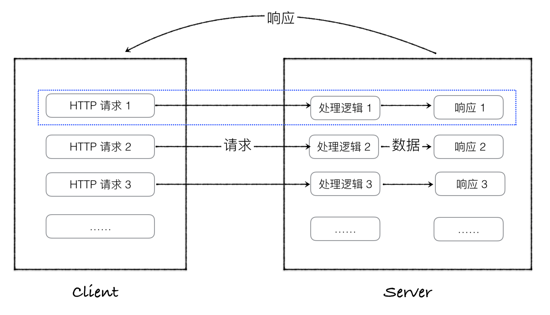

# 为什么要用Web框架

## Web应用程序的本质

Web(World Wide Web)诞生最初的目的，是为了利用互联网交流工作文档。

## 使用WEB框架的优点!

web网站发展至今，特别是服务器端，涉及到的知识、内容，非常广泛。这对程序员的要求会越来越高。如果采用成熟，稳健的框架，那么一些基础的工作，比如，安全性，数据流控制等都可以让框架来处理，那么程序开发人员可以把经理放在具体的业务逻辑上。使用框架的优点：

- 稳定性和可扩展性
- 可以降低开发难度，提高开发效率。

总结一句话：**避免重复造轮子**

