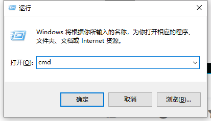

# 第一章 计算机基础知识

## 计算机是什么

在现实生活中，越来越无法离开计算机了

​	电脑、笔记本、手机、游戏机、汽车导航、智能电视...

计算机就是一个用来计算的机器！

目前来讲，计算机只能根据人类的指令来完成各种操作，人让它干嘛它就得干嘛

所以我们学习计算机，就是学习如何控制计算机！

## 计算机的组成

计算机由两部分组成：硬件 和软件 

硬件包含：键盘、鼠标、显示器、CPU、主板、内存、硬盘。。。

​	硬件是看得见摸得着的。

软件包含：系统软件（Windows、MacOS、Linux）和应用软件（office、QQ、绝地求生）

​	软件是看得见摸不着的，软件负责控制计算机中的硬件

## 计算机的使用方式

我们必须要通过软件来对计算机完成各种操作，但是注意，软件中并不是所有的功能都会对用户开放，用户要调用软件提供的接口（Interface 交互界面）来操作计算机

用户界面分成两种：TUI（文本交互界面）和GUI（图形化交互界面）

## Windows的命令行

命令行就是文本交互界面，通过命令行可以使用一个一个的指令来操作计算机，任何计算机的操作系统中都包含有命令行（Windows、Linux、MacOS）

命令行有多个不同的名字：

​	命令行、命令行窗口、DOS窗口、命令提示符、CMD窗口、Shell、终端、Terminal

​	练习：通过搜索引擎来搜索一下，各个操作系统当中的命令行窗口的样式。


### 1.如何进入到命令行

​	<kbd>Win</kbd>+<kbd>R</kbd> 出现运行窗口，输入cmd，然后回车



### 2.命令行的结构

- 版本及版权声明（一般没有什么用）

  ```shell
  Microsoft Windows [版本 10.0.17763.316]
  (c) 2018 Microsoft Corporation。保留所有权利。
  ```

- 命令提示符

  ```shell
  C:\Users\kofzhang>
  # C:  表示当前盘符   
  # 	命令——切换盘符：可以用X：切换盘符，X表示你的盘符
  # \Users\kofzhang  表示所在磁盘的路径，当前所在的文件夹
  # 	命令——切换目录：cd 命令
  # >    命令提示符，在大于号后可以直接输入指令
  #	
  ```

  练习：尝试使用多种方式进入到你的系统的命令行，并且观察你的和我的有什么区别？

### 3.常用的DOS命令

| 命令 | 作用                                                     |
| ---- | -------------------------------------------------------- |
| dir  | 查看当前目录下所有文件及文件夹                           |
| cd   | 进入到指定的目录<br />. 表示当前目录<br />..表示上级目录 |
| md   | 创建一个目录                                             |
| rd   | 删除一个目录                                             |
| del  | 删除一个文件                                             |
| cls  | 清除屏幕                                                 |

命令的语法

​	命令  [参数] [选项]

练习：通过搜索引擎搜索一下其他的DOS命令，并尝试使用一些命令的选项

### 4.小技巧

- 方向键上下，查看命令的历史记录
- tab键自动补全命令

## 环境变量（Environment Variable)

环境变量指的就是操作系统当中的一些变量。

可以通过修改环境变量，来对计算机进行配置（主要是来配置一些路径的）

1.查看环境变量

```
> 右键 计算机（此电脑），选择属性
>
> 系统界面左侧选择 高级系统设置
>
> 选择环境变量
```

环境变量界面分成了两个部分，上边是用户环境变量，瞎编是系统环境变量

​	*建议只修改用户的环境变量，不要修改系统的环境变量*

2.添加环境变量

> 通过新建按钮添加环境变量
>
> 一个环境变量可以有多个值，值与值之间使用;（英文）隔开

3.修改环境变量

> 通过编辑按钮来修改环境变量

4.删除环境变量

> 通过删除按钮来删除环境变量

练习4：创建一个USERNAME环境变量，修改USERNAME环境变量，并尝试添加多个值，然后删除USERNAME环境变量。

## Path环境变量

path环境变量中保存的是一个一个的路径。

当我们在命令行中输入一个命令（或访问一个文件时），系统会首先在当前目录下寻找，如果找到了则直接执行或打开；如果没有找到，则会依次去path环境变量的路径中去寻找，直到找到为止；如果path环境变量中的路径都没有找到，则报错

```shell
'xxx' 不是内部或外部命令，也不是可运行的程序或批处理文件。
```

我们可以将一些经常需要访问到的文件或程序的路径，添加到path环境变量中，这样我们就可以在任意的位置访问到这些文件了

注意事项：

> 1.如果环境变量中没有path，可以手动添加
>
> 2.path环境变量不区分大小写 PATH Path path
>
> 3.修改完环境变量必须重新启动命令行窗口
>
> 4.多个路径之间使用；隔开

练习5：在桌面创建一个hello文件夹，文件夹中创建一个abc.txt输入随意的内容然后将hello的路径添加到path环境变量中，尝试在任意位置访问abc.txt，最后将hello路径从path环境变量中删除。

## 进制

- 十进制

  - > 十进制就是满十进一的进制
    >
    > 十进制当中一共有10个数字
    >
    > ​	0  1  2  3  4  5  6  7  8  9
    >
    > 十进制如何计数
    >
    > ​	0  1  2  3  4  5  6  7  8  9  10  11  12  ...  19  20  ...  29  30

- 二进制

  - > 满二进一
    >
    > 二进制中一共有2个数字
    >
    > ​	0  1
    >
    > 二进制如何计数
    >
    > ​	0  1  10  11  100  101  110  111  1000
    >
    > 所有的数据在计算机底层都是以二进制的形式保存的，计算机只认二进制
    >
    > 可以将内存想想为一个一个的小格子，小格子中可以存储一个0或一个1
    >
    > 内存中的每一个小格子，我们成为1bit（位）
    >
    > ​	bit是计算机中的最小单位
    >
    > ​	Byte是我们最小的可操作的单位
    >
    > 
    >
    > ​	8bit=1Byte（字节）
    >
    > ​	1024Byte=1KB（千字节）
    >
    > ​	1024KB=1MB（兆字节）
    >
    > ​	1024MB=1GB（吉字节）
    >
    > ​	1024GB=1TB（太字节）
    >
    > ​	......

- 八进制（一般不用）

  - > 满八进一
    >
    > 八进制中一共有8个数字
    >
    > ​	0  1  2  3  4  5  6  7  
    >
    > 八进制如何计数
    >
    > ​	0  1  2  3  4  5  6  7  10  11  ...  17  20  ...  27  30

- 十六进制

  - > 满十六进一
    >
    > 十六进制中一共有16个数字
    >
    > ​	由于十六进制是满16才进位，所以十六进制中引入了a b c d e f来表示10 11 12 13 14 15
    >
    > 十六进制如何计数
    >
    > ​	0 1 2 3 4 5 6 7 8 9 a b c d e f 10 11 12 ... 1a 1b 1c 1d 1e 1f 20 21 22 ... 2a 2b 2c 2d 2e 2f 30
    >
    > 我们在查看二进制数据时，一般会以十六进制的形式显示
    >
    > 

## 文本文件和字符集

- 文本分成两种，一种叫纯文本，还有一种叫做富文本
- 纯文本中只能保存单一的文本内容，无法保存内容无关的东西（字体、颜色、图片...）
- 富文本中可以保存文本以外的内容（Word文档）
- 在开发时，编写程序使用的全都是纯文本！
- 纯文本在计算机底层也会转换为二进制保存
  - 将字符转换为二进制码的过程，我们称为编码
  - 将二进制编码转换为字符的过程，我们称为解码
  - 编码和解码时所采用的规则，我们称为字符集
- 常见的字符集
  - ASCII
    - 美国人编码，使用7位来对美国常用的字符进行编码
    - 包含128个字符
  - ISO-8859-1
    - 欧洲的编码，使用8位
    - 包含256个字符
  - GB2312
  - GBK
    - 国标码，中国的编码
  - Unicode
    - 万国码，包含世界上所有的语言和符号，编写程序时一般都会使用Unicode编码
    - Unicode编码有多种实现，UTF-8 UTF-16 UTF-32
    - 最常用的就是UTF-8
- 乱码
  - 编写程序时，吴国发现程序代码出现乱码的情况，就要马上去检查字符集是否正确

